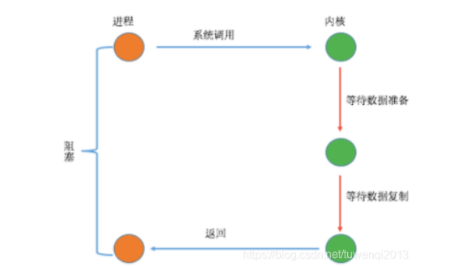
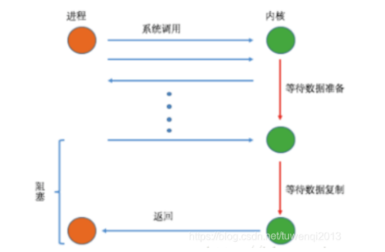
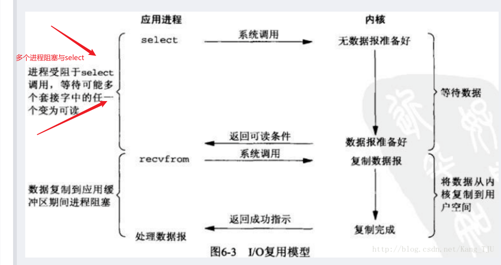
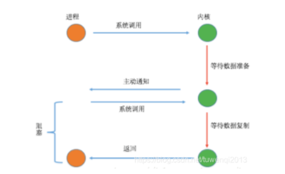
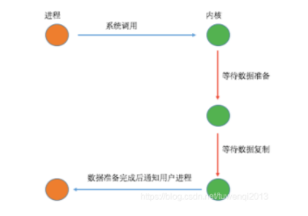

### 同步与异步
数据拷贝的时候应用程序进程是否阻塞

### 阻塞与非阻塞
应用程序的调用是否立即返回

### 两阶段
- 内核准备数据到缓冲区
- 缓冲区复制数据到用户进程内存空间

### 同步阻塞I/O

- 两阶段都是阻塞的
- 准备好数据及时返回，无延迟
- 性能下降

### 同步非阻塞I/O

- 第一个阶段非阻塞
- 第二个阶段阻塞

优点：能够在等待任务完成的时间里干其他活了

缺点：任务完成的响应延迟增大了，因为每过一段时间才去轮询一次read操作，而任务可能在两次轮询之间的任意时间完成。poling这种方式本生就会占用大量的cpu资源。做无用功

### 多路复用

- 当用户进程调用了select，那么整个进程会被block
- 而同时，kernel会轮询所有select负责的socket，当任何一个socket中的数据准备好了，select就会返回
- 这个时候用户进程再调用read操作，将数据从kernel拷贝到用户进程

select/epoll的好处就在于单个process就可以同时处理多个网络连接的IO。它的基本原理就是select，poll，epoll这个function会不断的轮询所负责的所有socket，当某个socket有数据到达了，就通知用户进程

### 信号驱动I/O

从上图可以看出，只有在I/O执行的第二阶段阻塞了用户进程，而在第一阶段是没有阻塞的。该模型在I/O执行的第一阶段，当数据准备完成之后，会主动的通知用户进程数据已经准备完成，即对用户进程做一个回调。该通知分为两种，一为水平触发，即如果用户进程不响应则会一直发送通知，二为边缘触发，即只通知一次

信号驱动I/O执行的第一阶段不阻塞，而第二阶段是阻塞的

### 异步I/O

从上图可以看出，在该模型中，当用户进程发起系统调用后，立刻就可以开始去做其它的事情，然后直到I/O执行的两个阶段都完成之后，内核会给用户进程发送通知，告诉用户进程操作已经完成了
异步 I/O执行的两个阶段都不会阻塞