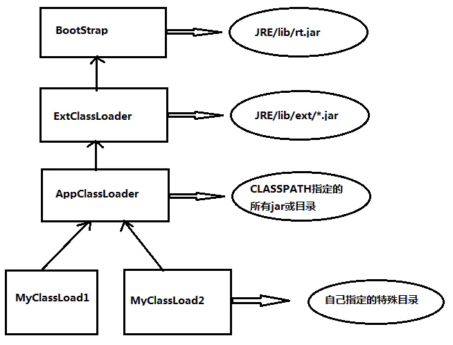

### 类的加载过程
- 加载
- 连接（验证，准备，解析）
- 初始化

### 类加载器

```
1)根类加载器,使用c++编写(BootStrap),负责加载rt.jar
2)扩展类加载器,java实现(ExtClassLoader)
3)应用加载器,java实现(AppClassLoader) classpath
```

### 双亲委派机制
- 当要加载一个类时，一层一层在加载器的指定目录上找。没有找到则往下一层找

### 双亲委派机制好处
我们在rt.jar中随便找一个类，如java.util.HashMap,那么我们同样也可以写一个一样的类，也叫java.util.HashMap存放在我们自己的路径下(ClassPath).那样这两个相同的类采用的是不同的类加载器，系统中就会出现两个不同的HashMap类，这样引用程序就会出现一片混乱

### 如何打破
- 自定义一个类加载器，继承ClassLoader类
- 重写findClass方法和loadClass方法