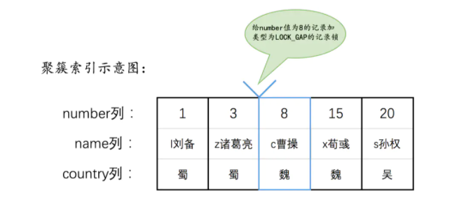
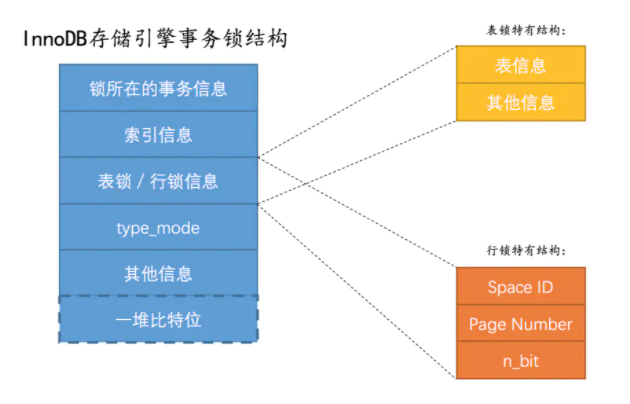

对于MyISAM、MEMORY、MERGE这些存储引擎来说，它们只支持表级锁

### 意向锁
IS锁和IX锁的使命只是为了后续在加表级别的S锁和X锁时判断表中是否有已经被加锁的记录，以避免用遍历的方式来查看表中有没有上锁的记录

### innerDb的record_lock锁
行锁，分为读写锁

### 间隙锁

在number列8加间隙锁，防止在3-8之间插入数据，解决幻读的问题

### next-key锁
相当于record_lock锁和间隙锁的合体

### 隐式锁
隐式锁：一个事务insert时可以不显式加锁，相当于有个隐式锁，其他事务对这个记录加S锁或X锁前会默认先给它加上锁

### innoDB锁的内存结构

### 注意:
只有通过索引条件检索数据，InnoDB才使用行级锁，否则，InnoDB将使用表锁！