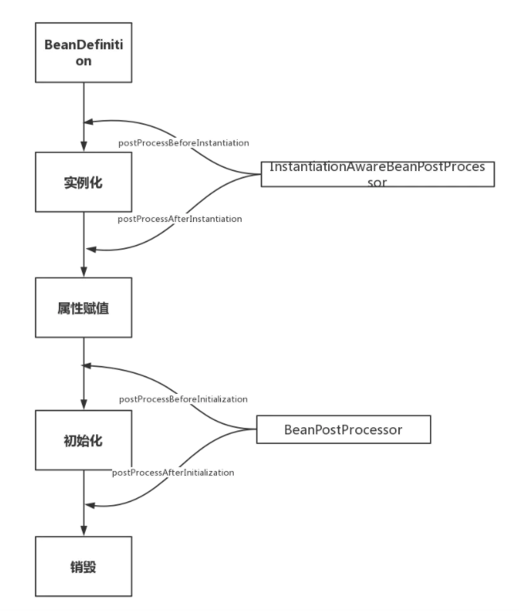

### bean的生命周期
- 实例化 Instantiation
- 属性赋值 Populate
- 初始化 Initialization
- 销毁 Destruction

### 扩展点

影响多个bean的接口
- InstantiationAwareBeanPostProcessor  
作用于bean实例化的前后

- BeanPostProcessor
作用于初始化阶段的前后

https://www.jianshu.com/p/1dec08d290c1