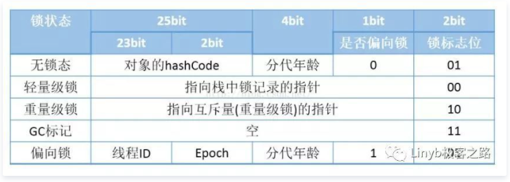

### 偏向锁获取流程(用于竞争比较少的情况)：
- 查看Mark Word中偏向锁的标识以及锁标志位，若是否偏向锁为1且锁标志位为01，则该锁为可偏向状态
- 若为可偏向状态，则测试Mark Word中的线程ID是否与当前线程相同，若相同，则直接执行同步代码，否则进入下一步
- 当前线程通过CAS操作竞争锁，若竞争成功，则将Mark Word中线程ID设置为当前线程ID，然后执行同步代码，若竞争失败，进入下一步
- 当前线程通过CAS竞争锁失败的情况下，说明有竞争。当到达全局安全点时之前获得偏向锁的线程被挂起，偏向锁升级为轻量级锁，然后被阻塞在安全点的线程继续往下执行同步代码

 偏向锁只有遇到其他线程尝试竞争偏向锁时，持有偏向锁状态的线程才会释放锁，线程不会主动去释放偏向锁。偏向锁的撤销需要等待全局安全点（即没有字节码正在执行），它会暂停拥有偏向锁的线程，撤销后偏向锁恢复到未锁定状态或轻量级锁状态。

### 轻量级锁加锁流程

- 当线程执行代码进入同步块时，若Mark Word为无锁状态，将mark work的数据拷贝进当前线程的栈帧
- 拷贝成功后，虚拟机将用CAS操作将对象的Mark Word更新为指向当前线程拷贝mark word的指针
- 如果更新成功，则这个线程拥有了这个锁，并将锁标志设为00，表示处于轻量级锁状态

- 如果更新失败，虚拟机会检查对象的Mark Word是否指向当前线程的栈帧，如果是则说明当前线程已经拥有这个锁，可进入执行同步代码。否则说明多个线程竞争，轻量级锁就会膨胀为重量级锁，Mark Word中存储重量级锁（互斥锁）的指针，后面等待锁的线程也要进入阻塞状态。

### 自旋锁
当一个线程A尝试进入同步代码块，但是当前的锁已经被线程B占有时，线程A不进入阻塞状态，而是不停的空转，等待线程B释放锁。如果锁的线程能在很短时间内释放资源，那么等待竞争锁的线程就不需要做内核态和用户态之间的切换进入阻塞状态，只需自旋，等持有锁的线程释放后即可立即获取锁，避免了用户线程和内核的切换消耗。

- 自旋最大等待时间
