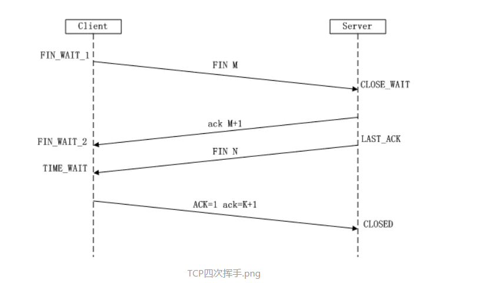

### 三次握手
- A发送SYN给B
- B响应ACK，同时发送自己的SYN给A
- A响应ACK

主要是确认双方都已经准备好

### 四次挥手
- client发送请求关闭的报文，进入等待状态
- server端发送ACK，进入关闭等待状态，并发送最后的数据
- client收到server端的ACK，进入终止等待状态2，接受server的数据
- server端发送完最后的数据后，发送连接关闭请求
- client收到报文后，发送ACK给server端，然后等待2*MSL（最报文寿命），进入关闭状态




```
LISTEN：侦听来自远方的TCP端口的连接请求

SYN-SENT：再发送连接请求后等待匹配的连接请求（客户端）

SYN-RECEIVED：再收到和发送一个连接请求后等待对方对连接请求的确认（服务器）

ESTABLISHED：代表一个打开的连接

FIN-WAIT-1：等待远程TCP连接中断请求，或先前的连接中断请求的确认

FIN-WAIT-2：从远程TCP等待连接中断请求

CLOSE-WAIT：等待从本地用户发来的连接中断请求

CLOSING：等待远程TCP对连接中断的确认

LAST-ACK：等待原来的发向远程TCP的连接中断请求的确认

TIME-WAIT：等待足够的时间以确保远程TCP接收到连接中断请求的确认

CLOSED：没有任何连接状态
```

### 为什么等待2*MSL才关闭
- client必须确认server端收到了ACK
- 假如最后一次client发送的FIN在网络中弄丢了
- 此时client端会再次收到关闭连接的报文，然后再次发送关闭连接的报文，再次等待2*MSL时间
- 直到在这时间内没有收到FIN，才会默认结束TCP连接，2MSL就是一个发送和一个回复所需的最大时间

### 为什么不能进行2此握手
- 确认双方已经做好了
- 防止在网络中延误的失效的连接请求的报文段突然传到了server端产生错误
- 假如两次握手，server收到了延误的报文，连接就建立了
- 而三次握手，client端会直接丢弃这个数据包，连接并不会建立

### 为什么TCP是可靠连接
- TCP 报文头里面的序号能使 TCP 的数据按序到达
- 报文头里面的确认序号能保证不丢包，累计确认及超时重传机制
- TCP 拥有流量控制及拥塞控制的机制（解决包丢失和超时重传）

### 为什么连接的时候是三次握手，关闭的时候却是四次握手？
- 需要等待server端的数据传输完成，传输完成会再次发送FIN报文

### 快速重传机制
