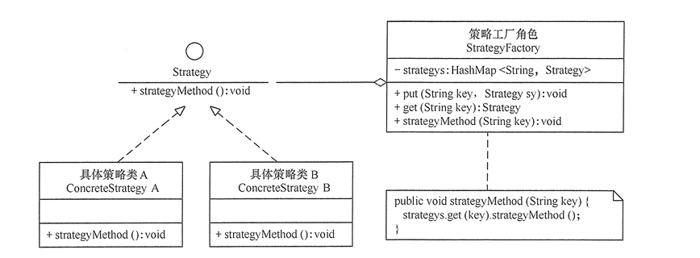

### 定义
该模式定义了一系列算法，并将每个算法封装起来，使它们可以相互替换，且算法的变化不会影响使用算法的客户。策略模式属于对象行为模式，它通过对算法进行封装，把使用算法的责任和算法的实现分割开来，并委派给不同的对象对这些算法进行管理
### 策略模式的主要优点如下
```
策略模式提供了一系列的可供重用的算法族，恰当使用继承可以把算法族的公共代码转移到父类里面，从而避免重复的代码。
策略模式可以提供相同行为的不同实现，客户可以根据不同时间或空间要求选择不同的。
策略模式提供了对开闭原则的完美支持，可以在不修改原代码的情况下，灵活增加新算法。
策略模式把算法的使用放到环境类中，而算法的实现移到具体策略类中，实现了二者的分离

```


